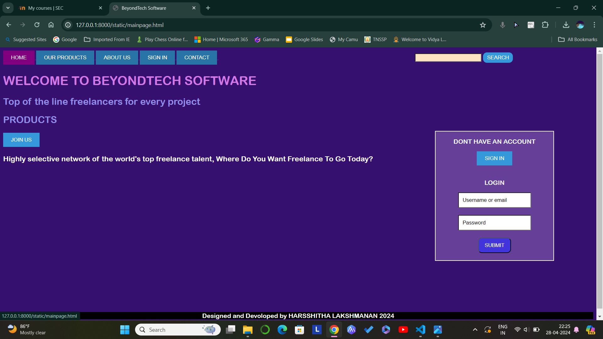
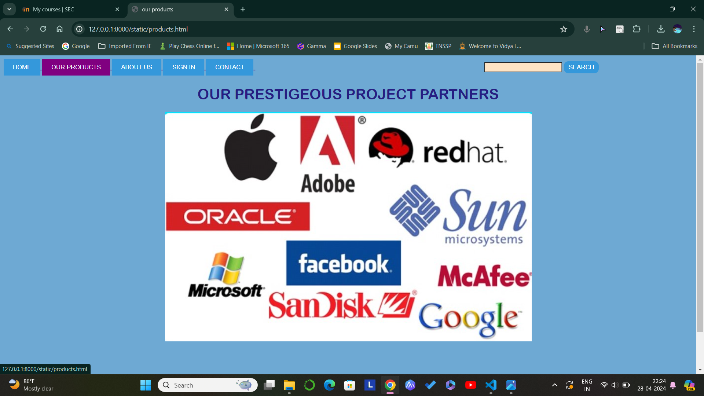
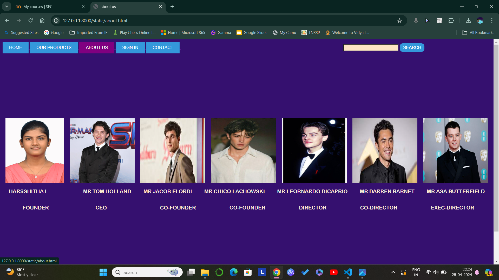
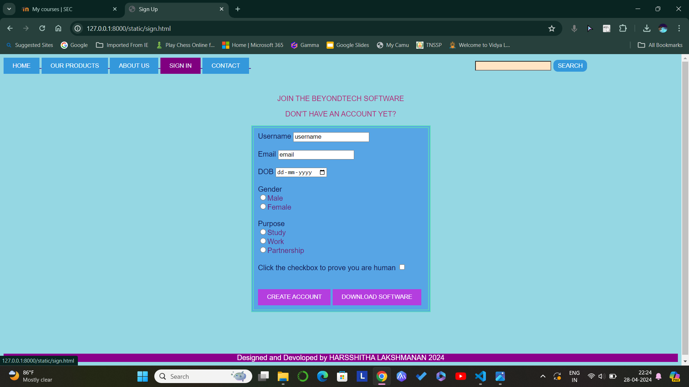
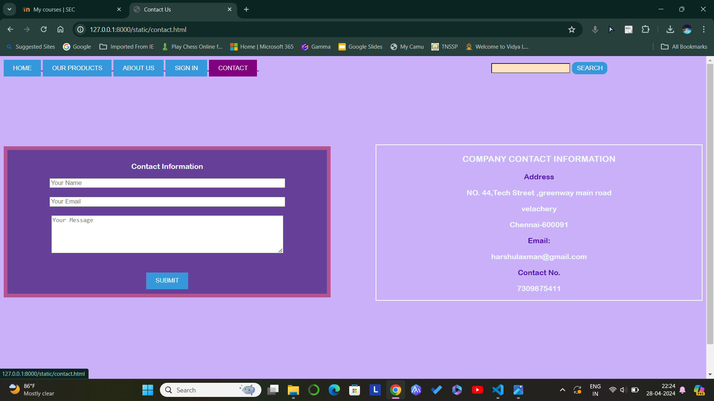

# Ex.07 Software Product Company Website
## Date:28/04/2024

## AIM:
To develop a static company website to display the softwares and services provided by the company.

## DESIGN STEPS:

### Step 1:
Requirement collection.

### Step 2:
Creating the layout using HTML and CSS.

### Step 3:
Updating the sample content.

### Step 4:
Choose the appropriate style and color scheme.

### Step 5:
Validate the layout in various browsers.

### Step 6:
Validate the HTML code.

### Step 7:
Publish the website in the given URL.

## PROGRAM:
```
mainpage.html

<html>
<title>BeyondTech Software</title>
<style>
    body{
        background:url(bg1.jpg) ;
        background-size: cover;
        
    }

    h1{
        color: rgb(208, 122, 228);
        
    }
    h2{
        color: rgb(146, 143, 228);
    }
    h3{
        color:rgb(255, 254, 254);
    }

/* the main window options*/
.styled form {
            margin-top: 20px;
            display: flex;
            justify-content: space-between;
        }
        .styled [type="button"] {
            padding: 10px 20px; /* button size */
            background-color: #2974a6; /* initial background color */
            color: #ffffff; /*initial text color */
            border: none;
            transition: background-color 0.3s, color 0.3s; /*smooth transition */
        }
        .styled [type="button"]:hover {
            background-color:purple; /*background color on hover */
            color:aliceblue; /*text color on hover */
        }
        .styled [type="submit"] {
            border-radius: 10px;
            padding: 5px 10px; /* button size */
            background-color: #3498db; /* initial background color */
            color: #ffffff; /*initial text color */
            border: none;
            transition: background-color 0.3s, color 0.3s; /*smooth transition */
        }
        .styled [type="submit"]:hover {
            background-color:purple; /*background color on hover */
            color:#ffffff; /*text color on hover */
        }
        .styled [type="text"] {
            margin-left: 500px;
            transition: background-color 0.3s; 
            background-color:bisque;
        }
        .styled input[type="text"]:focus {
    /* Change background color when input is focused */
    background-color:rgb(224, 127, 224); /* Adjust the color as needed */
}

.login{
    margin-top: -100;
    margin-left: 1100;
    margin-right: 100;    
    background:url(bg2.jpg);

    scroll-padding-left: 5px;
    border:2px solid white;
}
.login input[type="button"] {
    padding: 10px 20px; /*  button size */
    background-color: #3498db;
    color: #ffffff;
    border: none;
    cursor: pointer;
    transition: background-color 0.3s, color 0.3s;
}
.login input[type="button"]:hover {
    color:#000;
    background-color:rgb(204, 32, 204);
}
.login input[type="submit"]{
    padding: 10px 15px; /*  button size */
    background-color:#4234db;
    color: #ffffff;
    border-radius: 10px;
    cursor: pointer;
    transition: background-color 0.3s, color 0.3s;
}
.login input[type="submit"]:hover {
    color:#000;
    background-color:rgb(30, 192, 210);
}
.login input[type="text"] { 
    padding: 10px; /* Add padding for better appearance */
    transition: background-color 0.3s; /* Add transition for a smooth effect */
        /* Set initial background color */
        background-color: #ffffff;
}
.login input[type="text"]:focus {
    /* Change background color when input is focused */
    background-color:slateblue; /* Adjust the color as needed */
}
.join{
    padding: 10px 20px; /*  button size */
    background-color: #3498db;
    color: #ffffff;
    border: none;
    cursor: pointer;
    transition: background-color 0.3s, color 0.3s;
}
.join:hover {
    color: aquamarine;
    background-color: #4234db;
}


</style>
<body >
    <form class="styled ">
        <div class=>
            <a href="mainpage.html">
                <input type="button" value="HOME">
            </a>
            <a href="products.html">
                <input type="button" value="OUR PRODUCTS">
            </a>

            <a href="about.html">
                <input type="button" value="ABOUT US">
            </a>
            <a href="sign.html">
                <input type="button" value="SIGN IN">
            </a>
            <a href="contact.html">
                <input type="button" value="CONTACT">
            </a>  
            <input type="text">
            <input type="submit"value="SEARCH">  
        </div>
    </form>

    <h1>WELCOME TO BEYONDTECH SOFTWARE</h1>
    <h2>Top of the line freelancers for every project</h2>
    <h2>PRODUCTS</h2>
    <a href="sign.html">
        <input type="button" value="JOIN US" class="join">
    </a>  
    
    <h3>Highly selective network of the world's top freelance talent, Where Do You Want Freelance To Go Today?</h3>

         <center>
        <div class="login">
            <div class="login-box">
            <p style="color: aliceblue;">DONT HAVE AN ACCOUNT</p>
            <a href="sign.html">
                <input type="button" value="SIGN IN"><br><br>
            </a>  
            <p style="color: aliceblue;">LOGIN</p>
            <input type="text" value="Username or email" ><br><br>
            <input type="text" value="Password"><br><br>
            <a href="products.html">
                <input type="submit" value="SUBMIT"><br><br>
            </a>  
        </div>
        </div>
    </center>

</body>
<footer style="background-color:rgb(0, 0, 0);margin-top: 130px; border: none;">
    <P style="color:#ffffff; ;"align="center">Designed and Devoloped by HARSSHITHA LAKSHMANAN 2024 </P>
</footer>
</html>

products.html

<html>
    <title>our products</title>
    <style>  
    body{
        background:url(bg3.jpg);
        background-size:contain;
    } 
    h1{
        color: rgb(38, 29, 130);
    }  
    .styled form {
            margin-top: 20px;
            display: flex;
            justify-content: space-between;
        }
        .styled [type="button"] {
            padding: 10px 20px; /* button size */
            background-color: #3498db; /* initial background color */
            color: #ffffff; /*initial text color */
            border: none;
            transition: background-color 0.3s, color 0.3s; /*smooth transition */
        }
        .styled [type="button"]:hover {
            background-color:purple; /*background color on hover */
            color:aliceblue; /*text color on hover */
        }
        .styled [type="submit"] {
            border-radius: 10px;
            padding: 5px 10px; /* button size */
            background-color: #3498db; /* initial background color */
            color: #ffffff; /*initial text color */
            border: none;
            transition: background-color 0.3s, color 0.3s; /*smooth transition */
        }
        .styled [type="submit"]:hover {
            background-color:purple; /*background color on hover */
            color:#ffffff; /*text color on hover */
        }
        .styled [type="text"] {
            margin-left: 500px;
            transition: background-color 0.3s; 
            background-color:bisque;
        }
        .styled input[type="text"]:focus {
    /* Change background color when input is focused */
    background-color:rgb(161, 42, 161); /* Adjust the color as needed */
}
</style>
    
    <body>
        <form class="styled ">
            <div class=>
                <a href="mainpage.html">
                    <input type="button" value="HOME">
                </a>
                <a href="products.html">
                    <input type="button" value="OUR PRODUCTS">
                </a>
                <a href="about.html">
                    <input type="button" value="ABOUT US">
                </a>
                <a href="sign.html">
                    <input type="button" value="SIGN IN">
                </a>
                <a href="contact.html">
                    <input type="button" value="CONTACT">
                </a>  
                <input type="text">
                <input type="submit"value="SEARCH">  
            </div>
        </form>
        
        <center>
            <h1 >OUR PRESTIGEOUS PROJECT PARTNERS</h1>
        
    </center>
    </body>
    <footer style="background-color:rgb(190, 43, 190);margin-top: 125px; border: none;">
        <P style="color:#000000; ;"align="center">Designed and Devoloped by HARSSHITHA LAKSHMANAN 2024 </P>
    </footer>
</html>

about.html

<html>
<title>about us</title>
<style>
    p{
        color: antiquewhite;
    }
    body{
        background:url(bg1.jpg);
        background-size: cover;
    }
    .styled form {
            margin-top: 20px;
            display: flex;
            justify-content: space-between;
        }
        .styled [type="button"] {
            padding: 10px 20px; /* button size */
            background-color: #3498db; /* initial background color */
            color: #ffffff; /*initial text color */
            border: none;
            transition: background-color 0.3s, color 0.3s; /*smooth transition */
        }
        .styled [type="button"]:hover {
            background-color:purple; /*background color on hover */
            color:aliceblue; /*text color on hover */
        }
        .styled [type="submit"] {
            border-radius: 10px;
            padding: 5px 10px; /* button size */
            background-color: #3498db; /* initial background color */
            color: #ffffff; /*initial text color */
            border: none;
            transition: background-color 0.3s, color 0.3s; /*smooth transition */
        }
        .styled [type="submit"]:hover {
            background-color:purple; /*background color on hover */
            color:#ffffff; /*text color on hover */
        }
        .styled [type="text"] {
            margin-left: 500px;
            transition: background-color 0.3s; 
            background-color:bisque;
        }
        .styled input[type="text"]:focus {
    /* Change background color when input is focused */
    background-color:rgb(224, 127, 224); /* Adjust the color as needed */
}
.photos{
    display:flex;
    justify-content: space-around;
    margin-top: 200px;
}
.names{
    display:flex;
    justify-content: space-around;

}
.position {
    display: flex;
    justify-content: space-around;
    margin-left: 10px;
    border-image:5px;
    border-image: antiquewhite;
}

</style>
<body>
    <form class="styled ">
        <div class=>
            <a href="mainpage.html">
                <input type="button" value="HOME">
            </a>
            <a href="products.html">
                <input type="button" value="OUR PRODUCTS">
            </a>
            <a href="about.html">
                <input type="button" value="ABOUT US">
            </a>
            <a href="sign.html">
                <input type="button" value="SIGN IN">
            </a>
            <a href="contact.html">
                <input type="button" value="CONTACT">
            </a>  
            <input type="text">
            <input type="submit"value="SEARCH">  
        </div>
    </form>
    <div class="photos">
    
    
    
    
    
    
    
</div>
<div CLASS="names">
    <P>    HARSSHITHA L </P>    
    <P style="margin-left: 70;">   MR TOM HOLLAND</P>    
    <P>    MR JACOB ELORDI</P>    
    <P>   MR CHICO LACHOWSKI </P>    
    <P>MR LEORNARDO DICAPRIO</P>    
    <P> MR DARREN BARNET</P>    
    <P>MR ASA BUTTERFIELD</P>    
</div>
<DIV class="position">
    <p>FOUNDER </p>
    <p style="margin-left:40;">CEO </p>
    <p style="margin-left:60;">CO-FOUNDER </p>
    <p>CO-FOUNDER </p>
    <p>DIRECTOR </p>
    <p >CO-DIRECTOR</p>
    <p>EXEC-DIRECTOR </p>

</DIV>
</body>
<footer style="background-color:darkmagenta;margin-top: 218px; border: none;">
    <P style="color:#ffffff; ;"align="center">Designed and Devoloped by MALENI M 2023 </P>
</footer>
</html>

sign.html

<!DOCTYPE html>
<html>
<head>
    <title>Sign Up</title>
    <style>
        body {
            background:url(bg6.jpg);
            background-size: cover;
            color: rgb(172, 40, 123);
            font-family: Arial, sans-serif;
        }

        .form {
            margin: 0 auto;
            width: 400px;
            padding: 30px;
        }

        label {
            color: rgb(12, 15, 81);
        }

        .purpose {
            color: rgb(104, 27, 124);
        }

        .buttons {
            margin-top: 20px;
            padding: 10px 20px;
            background-color: #b43edf;
            color: #ffffff;
            border: none;
            cursor: pointer;
            transition: background-color 0.3s, color 0.3s;
        }

        .buttons:hover {
            color: aqua;
            background-color: #4234db;
        }
        .styled form {
            margin-top: 20px;
            display: flex;
            justify-content: space-between;
        }
        .styled [type="button"] {
            padding: 10px 20px; /* button size */
            background-color: #3498db; /* initial background color */
            color: #ffffff; /*initial text color */
            border: none;
            transition: background-color 0.3s, color 0.3s; /*smooth transition */
        }
        .styled [type="button"]:hover {
            background-color:purple; /*background color on hover */
            color:aliceblue; /*text color on hover */
        }
        .styled [type="submit"] {
            border-radius: 10px;
            padding: 5px 10px; /* button size */
            background-color: #3498db; /* initial background color */
            color: #ffffff; /*initial text color */
            border: none;
            transition: background-color 0.3s, color 0.3s; /*smooth transition */
        }
        .styled [type="submit"]:hover {
            background-color:purple; /*background color on hover */
            color:#ffffff; /*text color on hover */
        }
        .styled [type="text"] {
            margin-left: 500px;
            transition: background-color 0.3s; 
            background-color:bisque;
        }
        .styled input[type="text"]:focus {
    /* Change background color when input is focused */
    background-color:rgb(224, 127, 224); /* Adjust the color as needed */
}
.text{
    transition: background-color 0.3s, color 0.3s;

}
.text :focus{
    background-color:skyblue;  
}
.full{
    background:url(bg7.jpg);
    padding: 10px;
    border:6px double rgb(91, 221, 186);
}
    </style>
</head>
<body>
    <form class="styled ">
        <div class=>
            <a href="mainpage.html">
                <input type="button" value="HOME">
            </a>
            <a href="products.html">
                <input type="button" value="OUR PRODUCTS">
            </a>
            <a href="about.html">
                <input type="button" value="ABOUT US">
            </a>
            <a href="sign.html">
                <input type="button" value="SIGN IN">
            </a>
            <a href="contact.html">
                <input type="button" value="CONTACT">
            </a>  
            <input type="text">
            <input type="submit"value="SEARCH">  
        </div>
    </form>
    <div class="form">
        <p align="center">JOIN THE BEYONDTECH SOFTWARE</p>
        <p align="center">DON'T HAVE AN ACCOUNT YET?</p>
        <div class="full">
        <div class="text">
           
        <label>Username</label>
        <input type="text" value="username"><br><br>
        <label>Email</label>
        <input type="email" value="email"><br><br>
        </div>
        <label>DOB</label>
        <input type="date"><br><br>
        <label>Gender</label><br>
        <div class="purpose">
            <input type="radio" name="gender">Male<br>
            <input type="radio" name="gender">Female<br><br>
        </div>
        <label>Purpose</label><br>
        <div class="purpose">
            <input type="radio" name="purpose">Study<br>
            <input type="radio" name="purpose">Work<br>
            <input type="radio" name="purpose">Partnership<br><br>
        </div>
        <label>Click the checkbox to prove you are human</label>
        <input type="checkbox"><br><br>
        
            <input type="submit" value="CREATE ACCOUNT" class="buttons">
            <input type="submit" value="DOWNLOAD SOFTWARE"class="buttons">
        
    </div>
</div>
</body>
<footer style="background-color:darkmagenta;margin-top:63px; border: none;">
    <P style="color:#ffffff ;"align="center">Designed and Devoloped by HARSSHITHA LAKSHMANAN 2024 </P>
</footer>
</html>

contact.html

<!DOCTYPE html>
<html>
<head>
    <title>Contact Us</title>
    <style>
        b{
            color:rgb(75, 11, 176)
        }
        p {
            color: aliceblue;
        }

        body {
            background:url(bg5.jpg);
        }

        .yourinfo {
            background:url(bg2.jpg);
            border:8px solid rgb(178, 84, 146);
            margin-right: 800px ;
            
            margin-top: 150px; /* Adjusted margin-top */
            padding: 10px; /* Added padding for better spacing */
        }
        .yourinfo input[type="text"] {
            width: 500px;
            transition: background-color 0.3s; 
        }
        .yourinfo input[type="text"]:focus {
    /* Change background color when input is focused */
    background-color: #2278c3; /* Adjust the color as needed */
}

        .buttons {
            margin-top: 20px;
            padding: 10px 20px;
            background-color: #3498db;
            color: #ffffff;
            border: none;
            cursor: pointer;
            transition: background-color 0.3s, color 0.3s;
        }

        .buttons:hover {
            color: aqua;
            background-color: #34aedb;
        }
        .styled form {
            display: flex;
            justify-content: space-evenly;
        }
        .styled form {
            margin-top: 20px;
            display: flex;
            justify-content: space-between;
        }
        .styled [type="button"] {
            padding: 10px 20px; /* button size */
            background-color: #3498db; /* initial background color */
            color: #ffffff; /*initial text color */
            border: none;
            transition: background-color 0.3s, color 0.3s; /*smooth transition */
        }
        .styled [type="button"]:hover {
            background-color:purple; /*background color on hover */
            color:aliceblue; /*text color on hover */
        }
        .styled [type="submit"] {
            border-radius: 10px;
            padding: 5px 10px; /* button size */
            background-color: #3498db; /* initial background color */
            color: #ffffff; /*initial text color */
            border: none;
            transition: background-color 0.3s, color 0.3s; /*smooth transition */
        }
        .styled [type="submit"]:hover {
            background-color:purple; /*background color on hover */
            color:#ffffff; /*text color on hover */
        }
        .styled [type="text"] {
            margin-left: 500px;
            transition: background-color 0.3s; 
            background-color:bisque;
        }
        .styled input[type="text"]:focus {
    /* Change background color when input is focused */
    background-color:rgb(135, 61, 135); /* Adjust the color as needed */
}
    
.company{

margin-left: 800px;
margin-top: -330px;
background:url(bg5.jpg);

scroll-padding-left: 5px;
border:2px solid white;
}
.message textarea {
        background-color: white; /* Set the default background color */
        color: black; /* Set the default text color */
    }

    /* Styles for the text area when it is in focus */
.message    textarea:focus {
        background-color: cadetblue; /* Set the background color when in focus */
        color: white; /* Set the text color when in focus */
    }
    </style>
</head>
<body>
    <form class="styled">
        <div>
            <a href="mainpage.html">
                <input type="button" value="HOME">
            </a>
            <a href="products.html">
                <input type="button" value="OUR PRODUCTS">
            </a>
            <a href="about.html">
                <input type="button" value="ABOUT US">
            </a>
            <a href="sign.html">
                <input type="button" value="SIGN IN">
            </a>
            <a href="contact.html">
                <input type="button" value="CONTACT">
            </a>
            <input type="text" >
            <input type="submit" value="SEARCH">
        </div>
    </form>
    <div class="yourinfo">
        <center>
        <p>Contact Information</p>
        <div>            
            <input type="text" maxlength="100" placeholder="Your Name"><br><br>
            <input type="text" maxlength="100" placeholder="Your Email"><br><br>
            <div class="message">
            <textarea rows="5" cols="65" placeholder="Your Message"></textarea><br><br>
        </div>
            <input type="button" value="SUBMIT" class="buttons">
        
        </center>
        </div>
    </div>
    <div class="company">
        <center>
        <h3 style="color: aliceblue;">COMPANY CONTACT INFORMATION</h3>
       <p> <b >Address</b></p>
        <p >NO. 44,Tech Street ,greenway main road</p>
        <p >velachery</p>
        <p >Chennai-600091</p>
        <b >Email:</b>
        <p >harshulaxman@gmail.com</p>
        <b >Contact No.</b>
        <p >7309875411</p>
    </center>
    </div>
</body>
<footer style="background-color:darkmagenta;margin-top: 200px; border: none;">
    <P style="color:#ffffff ;"align="center">Designed and Devoloped by MALENI M 2023 </P>
</footer>
</html>

```

## OUTPUT:






## RESULT:
The program for designing software company website using HTML and CSS is completed successfully.
